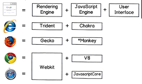
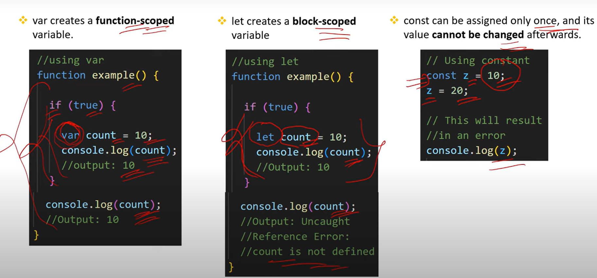
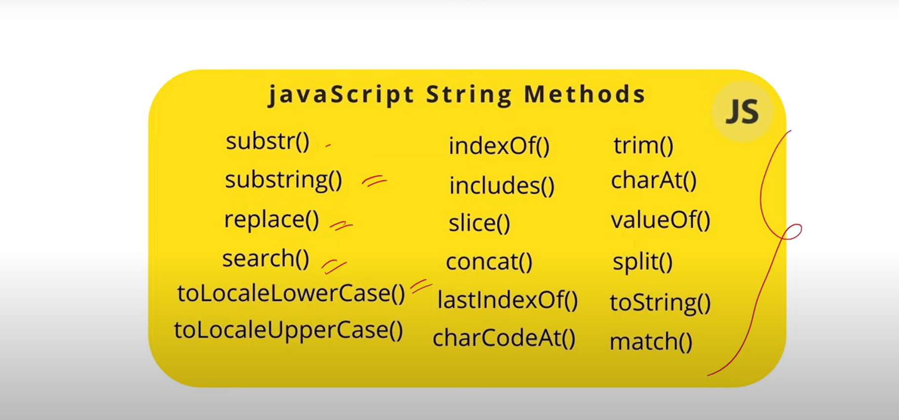
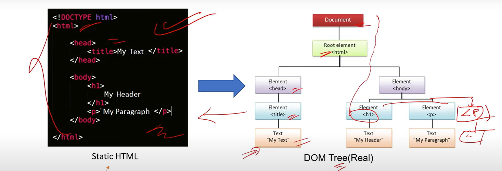

# Javascript_Interview_Ready

## 1. What is Javascript? What is the role of Javascript engine?
-> Javascript is a programming language that is used for converting static web pages to __interactive and dynamic__ web pages.

-> A Javascript engine is a program present in web browsers that executes Javascript code.




## 2. What are Client side and Server side? 
-> A client is a device, application, or software component that __requests__ and consumes services or resources from a server.

-> A server is a device, computer, or software application that __provide__  services, resources or functions to clients.  


## 3. What are Variables? What is the difference between var,let and const ? (v.imp)
-> Variables to use to __store__ data.
`` var a = 12 ``



## 4. What are some important String Operations in JS?



### a. Concatenation

```
//Add multiple string 
let str1 = "Hello";
let str2 = "World";
let result = str1 + " " + str2;
console.log(result) // Output : Hello World


or 

// Using concate() method
let result2 = str1.concate(" ", str2);
console.log(result2) // Output : Hello World
```

### b. Extract a portion of the string

```
let subString = result.substring(6,11);
console.log(subString) // Output : World

```

### c.Length of a String
```
console.log(result.length);
// Output : 11
 
```

### d.Convert a string to UpperCase or LowerCase

```
console.log(result.upperCase());
// Output : Hello World

console.log(result.lowerCase());
// Output : hello world

```

### e. Split a string into an array of substrings based on a delimiter

```
let arr = result.split(" ");
console.log(arr);
// Output : ["Hello","World"]

```

### f. Replace occurences of a substring within a string
```
console.log(result.replace("World","Javascript"));
// Output : Hello Javascript
```

### g. Remove leading and trailing white spaces
```
let str = "  .Hello World    ";
let trimmedStr = str.trim();
console.log(trimmedStr)
// Output : .Hello World
```
### h. Slice()

-> The slice() method returns selected elements in an array, as a new array.
-> The slice() method selects from a given start, up to a (not inclusive) given end.
-> The slice() method does not change the original array.

`` array.slice(start, end) ``

```
const fruits = ["Banana", "Orange", "Lemon", "Apple", "Mango"];
const citrus = fruits.slice(1, 3);
console.log(citrus)
// Output : Orange,Lemon

```

## 5. What is DOM? What is the difference between HTML and DOM ? (V.IMP)

-> The DOM (Document Object Model) represents the web page as a __tree like structure__ that allows javascript to dynamically access and manipulate the content and structure of the webpage.



## 6. What are Selectors ?

-> Selectors are used to target and retrieve HTML elements from the DOM so we can manipulate them.

### Types of Selectors

### 1. ID Selector(`getElementById`):
```
const element = document.getElementById("myId");
```
-> Use Case : When you want to select a single, unique element.

### 2. Class Selector(`getElementsByClassName`):
```
const elements = document.getElementsByClassName("myClass");
```
-> Use Case : When you want to select multiple elements sharing same classes.

### 3. Tag Selector(`getElementsByTagName`):
-> This method selects all elements of a given tag name (e.g., div, p, h1). It also returns an HTMLCollection.

```
const elements = document.getElementsByTagName('p');
```

-> Use Case: When you want to target all elements of a certain tag.

### 4. CSS selector All(`querySelectorAll`):
-> This method selects all elements that match a specified CSS selector and returns a NodeList (which can be iterated over using forEach).

```
const elements = document.querySelectorAll('.myClass');
elements.forEach(el => {
  // Do something with each element
});
```

-> Use Case: When you want to select multiple elements based on a complex selector.


